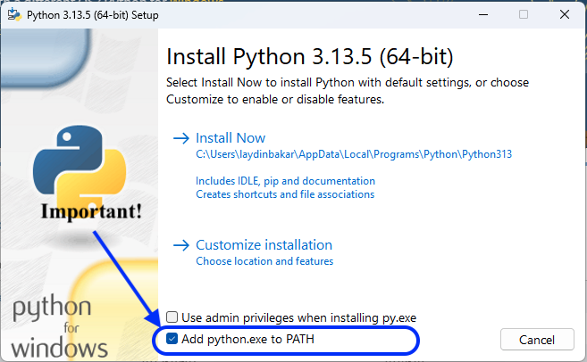
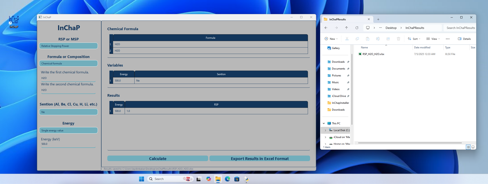

# How to install InChaP on Windows?

To use the program on a computer with a 
Windows operating system please send an email to 
`physics.calculation@gmail.com` using your email adress with `.edu` extension. 
Then, you will get a link to download the `InChapInstaller.exe` file.

To install InChaP on your Windows computer, you need to have installed Python on your computer. 
You can install Python for free from [here](https://www.python.org/downloads/). 
Later, you need to check the `Add python.exe to PATH` option as shown in the figure below. 

Once you installed Python on your computer, you can double click the `InChapInstaller.exe` file 
and continue with `Yes`, `Install` and `Finish` buttons respectively. 

Finally, you can double click the InChaP icon on your Desktop to open the program.

The results can be saved in a folder named `InChaPResults` on the `Desktop` directory of your Windows computer.
