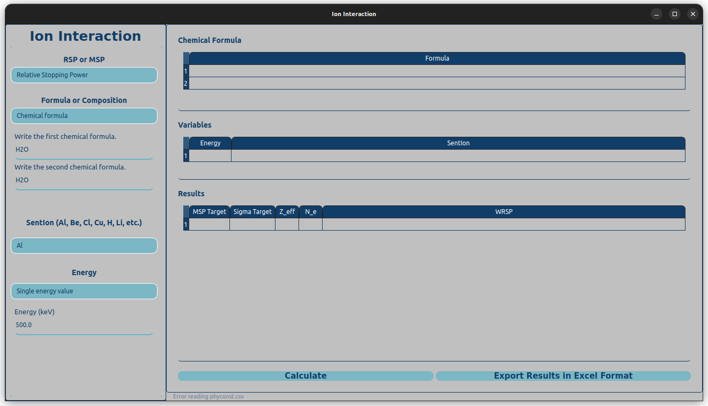

# Ion Interaction

The Ion Interaction: A small open-source software tool designed to calculate ...



This work was originally written to support the following paper, submitted to a journal:

```
@article{Buyukyildiz2024,
title = "...",
journal = "...",
volume = "...",
pages = "...",
year = "2024",
issn = "...",
author = "M. Buyukyildiz, ..."
}
```

To install the code and use on a computer with a Linux operating system you can clone this repository and run the following command on a terminal.

```
python3 ionInteraction.py
```

To use the program on a computer with a Windows operating system please send an email to `physics.calculation@gmail.com` using your email adress with `.edu` extension. Then, you will get a link to download the `ionInteraction.exe` file.

