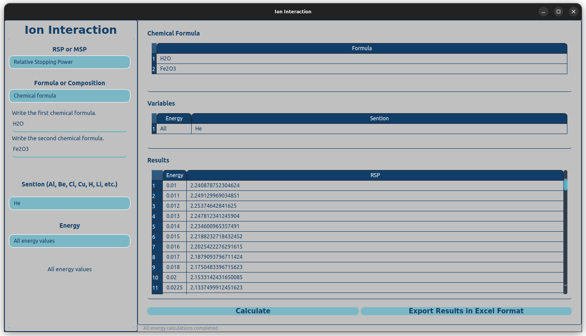
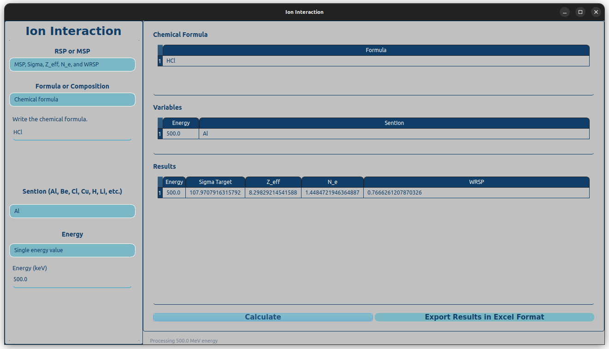

# Ion Interaction

The Ion Interaction: A small open-source software tool designed to calculate ...

<!--
https://youtu.be/i2fJau_8EJE?si=Ck4wtqnYSKsxEzxN

https://img.youtube.com/vi/Ck4wtqnYSKsxEzxN/0.jpg


<iframe width="560" height="315" src="https://www.youtube.com/embed/i2fJau_8EJE?si=Ck4wtqnYSKsxEzxN" title="YouTube video player" frameborder="0" allow="accelerometer; autoplay; clipboard-write; encrypted-media; gyroscope; picture-in-picture; web-share" referrerpolicy="strict-origin-when-cross-origin" allowfullscreen></iframe>
-->

[](https://www.youtube.com/watch?v=i2fJau_8EJE)





This work was originally written to support the following paper, submitted to a journal:

```
@article{Buyukyildiz2024,
title = "...",
journal = "...",
volume = "...",
pages = "...",
year = "2024",
issn = "...",
author = "M. Buyukyildiz, ..."
}
```

To install the code and use on a computer with a Linux operating system you can clone this repository and run the following command on a terminal.

```
python3 ionInteraction.py
```

To use the program on a computer with a Windows operating system please send an email to `physics.calculation@gmail.com` using your email adress with `.edu` extension. Then, you will get a link to download the `ionInteraction.exe` file.

