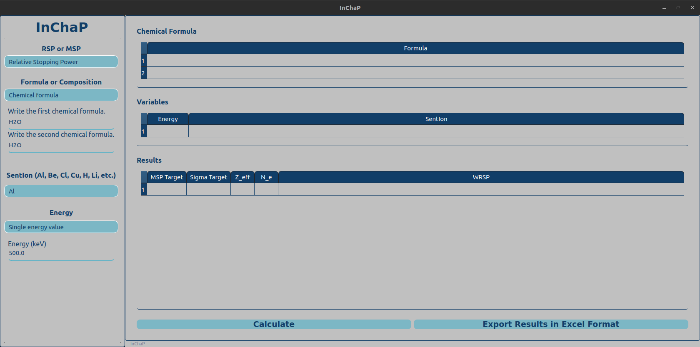

# InChap

The InChap: A new software **In**teraction of **Ch**arged **P**articles has been developed to model ion interactions for a variety of applications. 
Built with Python and leveraging advanced physical models and computational methods, 
InChaP supports simulations across an energy range of 0.01 to 1000 MeV. 
The software computes key parameters such as mass stopping power, 
stopping cross-section (S_e), 
relative stopping power (RSP), 
effective atomic number (Z_eff), and 
electron density (N_e) 
for any chemical compound or composite material. 
It utilizes a logarithmic interpolation method to ensure accuracy over a broad range of ion energies and 
enables users to generate results for specific ions at any energy within its operational range. 
Results can be exported in widely used spreadsheet formats, and 
the software is freely accessible to researchers.



This work was originally written to support the following paper, submitted to a journal:

```
@article{Cici2025,
title = "InChaP: A Simple Software for Computation of Charged Particle Interaction Parameters",
journal = "Nuclear Engineering and Technology",
volume = "",
pages = "",
year = "2025",
issn = "",
author = "A. Çiçi and B. Morkoç and H. Dağ and L. Aydinbakar and M.I. Sayyed and M. Büyükyıldız"
}
```

To install the code and use on a computer with a Linux operating system you can clone this repository and run the following command on a terminal.

```
pip3 install -r requirements.txt

python3 inchap.py
```

To use the program on a computer with a Windows operating system please send an email to `physics.calculation@gmail.com` using your email adress with `.edu` extension. Then, you will get a link to download the `inchap.exe` file.

[How to install InChaP on Windows?](InChaP_Windows/README.md)
